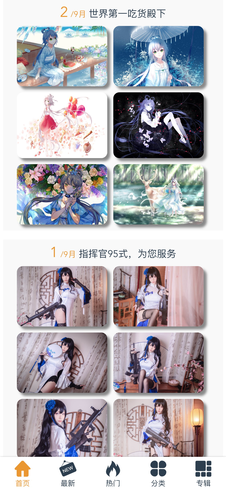

# vue-wallpaper

>  基于vue2的壁纸应用,使用vue-cli搭建项目,使用vue-router做路由管理,
使用vuex做状态管理,网络请求使用axios.


## 安装
``` bash
# 获取项目
git clone https://github.com/HurTeng/vue-wallpaper.git

# 进入文件夹
cd vue-wallpaper

# 安装依赖(npm)
npm install

# 开启本地服务器(http://localhost:9090)
npm run dev

# 项目发布
npm run build
```

# 项目截图
* 首页



* 最新壁纸


* 热门壁纸


* 壁纸分类


* 专辑列表


* 专辑详情


* 图片详情


### 项目结构
***
<pre>
├── build              // 构建服务和webpack配置
├── config             // 项目不同环境的配置
├── dist               // 项目build目录
├── index.html         // 项目入口文件
├── package.json       // 项目配置文件
├── src                // 生产目录
│   ├── assets         // 图片资源
│   ├── common          // 公共的css js 资源
│   ├── components     // 各种组件
│   ├── App.vue         // 主页面 
│   ├── vuex           // vuex状态管理器
│   ├── router.js     // 路由配置器
│   └── main.js        // Webpack 预编译入口
</pre>

### Vue组件说明
<pre>
├──item              // item内容数据
│   ├────albumInfo.vue     // 专辑信息
│   ├────albumItem.vue     // 专辑内容
│   ├────comment.vue      // 评论信息
│   ├────imgInfo.vue      // 图片信息
│   └────selection.vue    // 分类数据
├──list             // 列表数据
│   ├────album.vue        // 专辑列表
│   ├────category.vue     // 壁纸分类列表
│   ├────hot.vue          // 热门壁纸列表
│   ├────new.vue          // 最新壁纸列表
│   ├────particular.vue   // 特定分类列表
│   └────wallpaper.vue    // 首页数据列表
├──page             // 页面相关
│   ├────pic.vue          // 图片页面
│   └────wecome.vue       // 欢迎页面
├──widget           // 控件相关
│   ├────backbar.vue    // 返回的bar组件
│   ├────lazyimg.vue    // 图片加载组件
│   ├────loading.vue    // 页面加载组件
│   └────tabs.vue       // 底部导航栏
</pre>
